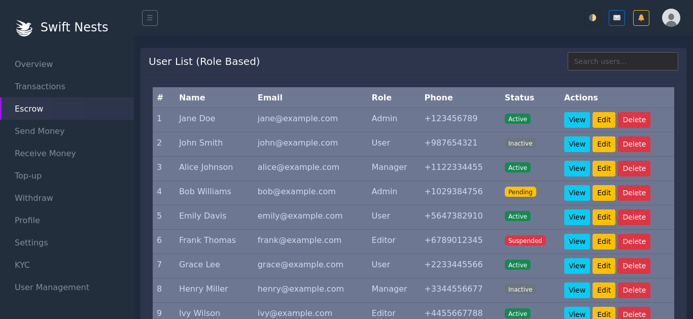
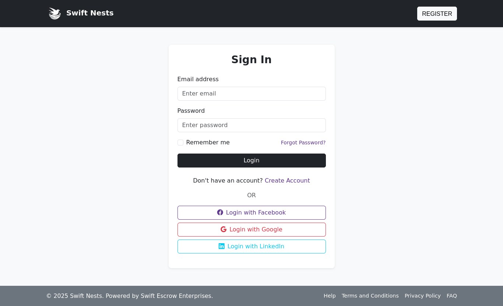
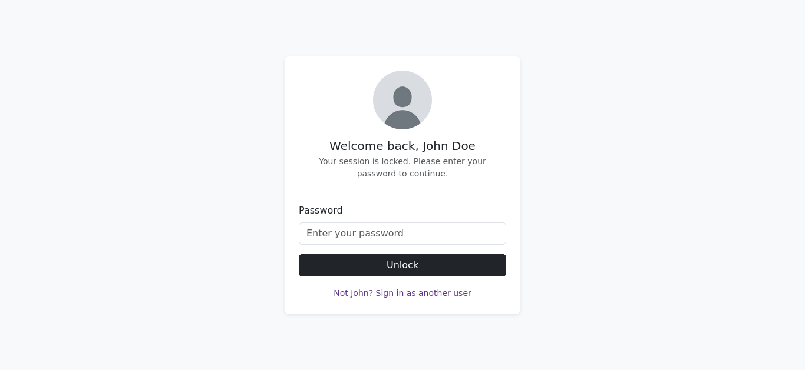
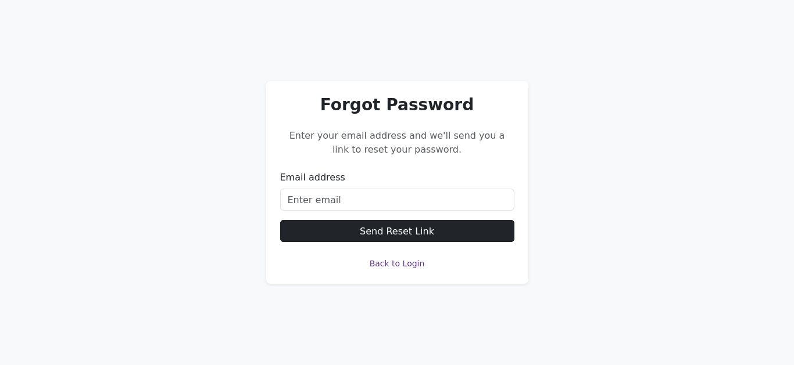
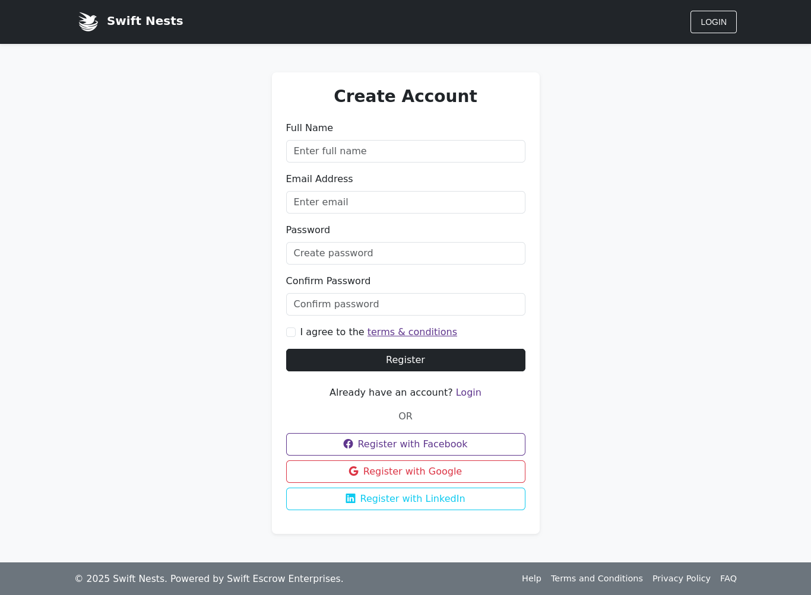
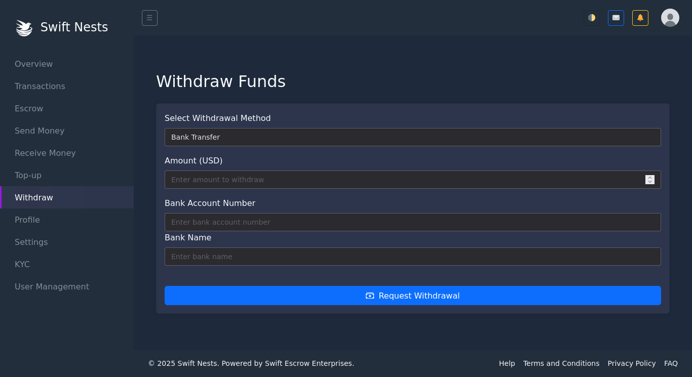
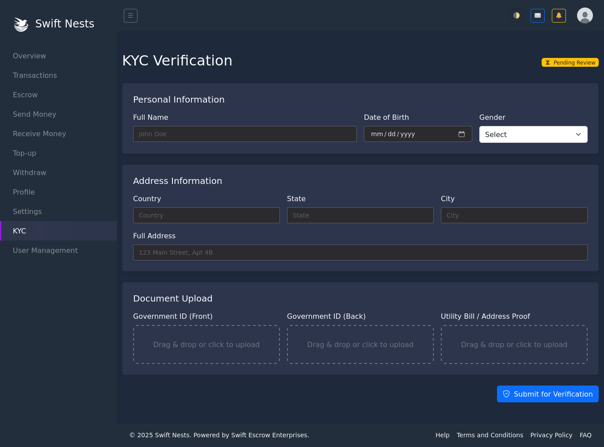
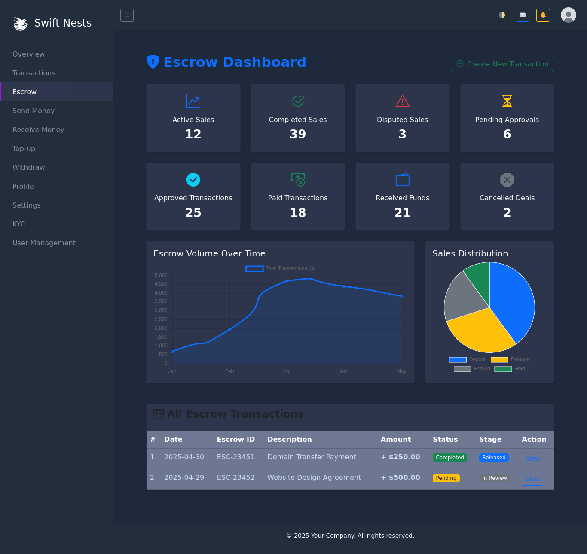
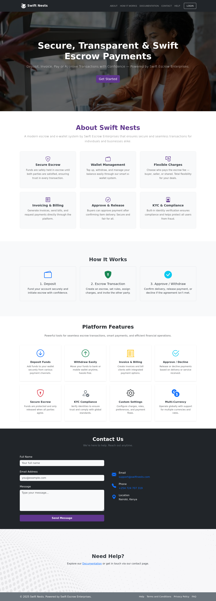

# 🚀 Bootstrap Admin Dashboard Template

A **simple, modern, and easy-to-use Bootstrap 5 Admin Dashboard Template** designed for quick integration into any web project. Ideal for dashboards, web apps, financial platforms, and internal tools.

> ✅ Clone, customize, and use it in your own project — it's developer-friendly and ready out of the box!

---

## ✨ Features

- ✅ Landing Page
- ✅ Login / Register / Forgot Password
- ✅ Lock Screen
- ✅ Dashboard with Charts
- ✅ Send Money Interface
- ✅ Escrow View
- ✅ Dropzone File Upload
- ✅ Forms, Cards, and Buttons
- ✅ Fully Responsive (Mobile & Desktop)
- ✅ Clean HTML/CSS/JS with Bootstrap 5

---

## 📸 Screenshots

### 🏠 Sample Dashboard Page


### 🔐 Login Page


### 🔒 Lock Screen


### 🔑 Forgot Password


### 🧾 Register


### 💸 Send Money



### 🧮 Landing Page Escrow View



---

## 🛠️ Installation

### 1. Clone the Repository

```bash
git clone git@github.com:Stephenmasaku/Bootstrap-Admin-Dashboard-Template.git
cd Bootstrap-Admin-Dashboard-Template
